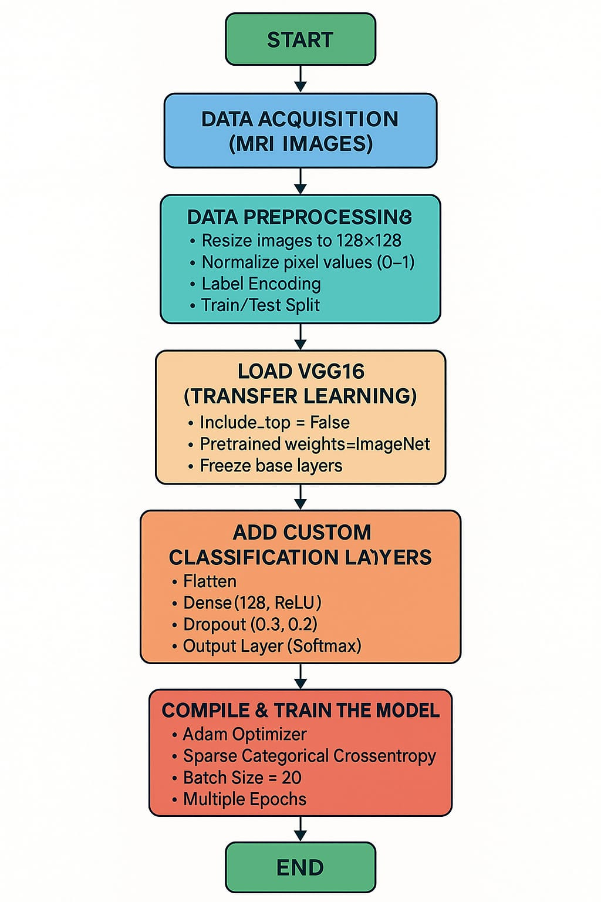

⚠️ Dataset is not included due to size limitations.
Download dataset from Kaggle and place it in /dataset folder.
# 🧠 Brain Tumor Classification using EfficientNet-B0

This project performs brain tumor classification from MRI images using **EfficientNet-B0** with **GradCAM visualization** for model explainability.

---

## 📌 Project Overview

The system classifies MRI brain scans into four categories:

- Glioma
- Meningioma
- Pituitary Tumor
- No Tumor

Transfer Learning is used to improve accuracy while reducing training time.  
GradCAM is applied to visualize which regions influenced model predictions.

---
## Methodology



## 📁 Project Structure

brain-tumor-classification/
│
├── braintumour.ipynb      # Training + testing notebook
├── README.md              # Project documentation

---

## 🧠 Dataset

- Dataset: Brain Tumor MRI Dataset (Kaggle)
- Total images: 7200
- Classes:
  - Glioma
  - Meningioma
  - Pituitary Tumor
  - No Tumor

### Data Split
- Training: 1400 images per class
- Testing: 400 images per class

---

## ⚡ Model Used

- EfficientNet-B0 (Transfer Learning)
- Pretrained on ImageNet
- Modified final layer for 4 classes
- Optimizer: Adam
- Loss Function: Categorical Cross Entropy

---

## 🔥 Explainability (GradCAM)

GradCAM is used to highlight important regions of MRI scans that influence predictions.

Benefits:
- Helps understand model decisions
- Improves trust in medical AI
- Visual explanation of tumor regions

---

## 📊 Results

- Best model: EfficientNet-B0
- Accuracy: ~97%
- Metrics used:
  - Accuracy
  - Precision
  - Recall
  - F1 Score

---

## ▶️ How to Run

1. Install dependencies:

```bash
pip install -r requirements.txt
